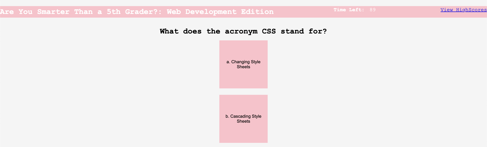
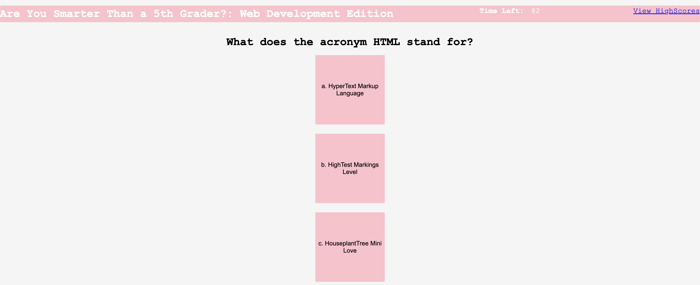
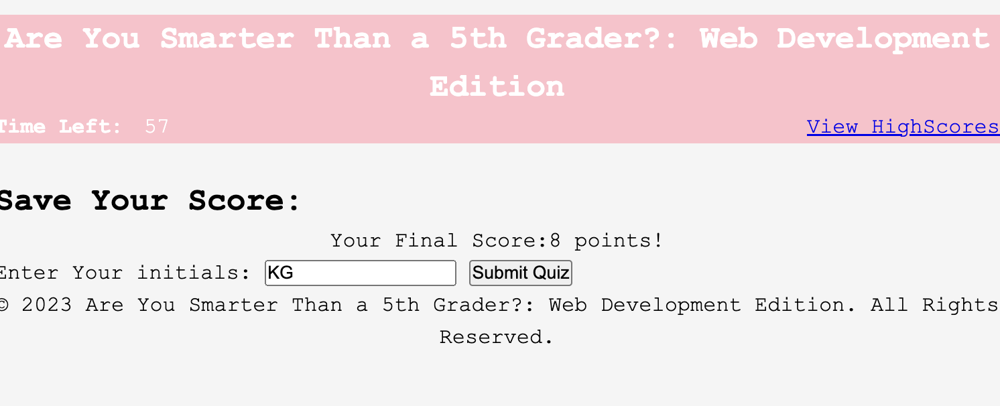

# Code Quiz

## Description 

A timed multiple-choice quiz on the basics of Web Development that stores high scores. Any question answered incorrectly will result in time being substracted from the timer. When all questions are answered or the timer reaches 0, the quiz is over. At the end of the quiz, the user will be able to save their high school and initials. 

## Table of Contents

- [Installation](#installation)
- [User Story](#user-story)
- [Instructions](#instructions)
- [Technologies](#technologies)
- [Application Screenshots](#application-screenshots)
- [Websites](#websites)
- [Author](#author)
- [License](#license)

### Installation 

1. Clone or download the repository to your own local machine. 
2. Open the HTML (index.html) file in the browser of your choice. 
3. Take the quiz 

### User Story

- AS A coding boot camp student
- I WANT to take a timed quiz on JavaScript fundamentals that stores high scores
- SO THAT I can gauge my progress compared to my peers

### Instructions

1. Click "Start Quiz" to begin the quiz.
    - The timer will start and the first question will appear.
    - Total time is 100 seconds.
    - 10 questions total.
2. A series of questions will appear with multiple choice answers. 
    - Click on the answer you think is correct.
    - If you answer incorrectly, 10 seconds will be subtracted from the timer.
3. When all questions are answered or the timer reaches 0, the quiz is over.
4. At the end of the quiz, the user will be able to save their high score and initials.
    - Enter your initials and click "Submit".
    - Your score will be saved to the High Scores page.
5. It will show a list of high scores.

### Technologies

- Visual Studio Code
- HTML
- CSS
- JavaScript 

### Application Screenshots

### Websites

- [Github Repository](https://github.com/kimberlie901/JavaScript_Quiz)
- [Deployed Application](https://kimberlie901.github.io/JavaScript_Quiz/)

### Author

This application was created by Kimberlie Guillaume

- [Github](https://github.com/kimberlie901)
- [Portfolio](https://kimberlie901.github.io/Professional_Portfolio/) 
- [LinkedIn](https://www.linkedin.com/in/kjguill1024/)

### License 

Please refer to the LICENSE in the repo.
Copyright (c) Kimberlie Guillaume. All rights reserved.